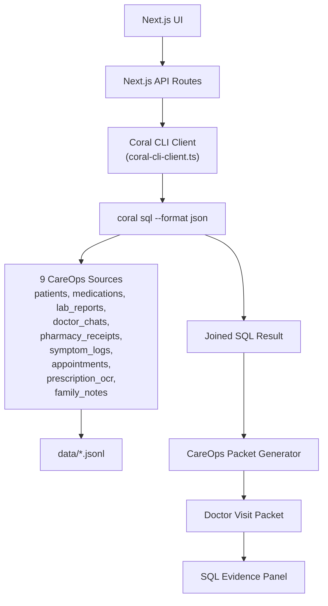
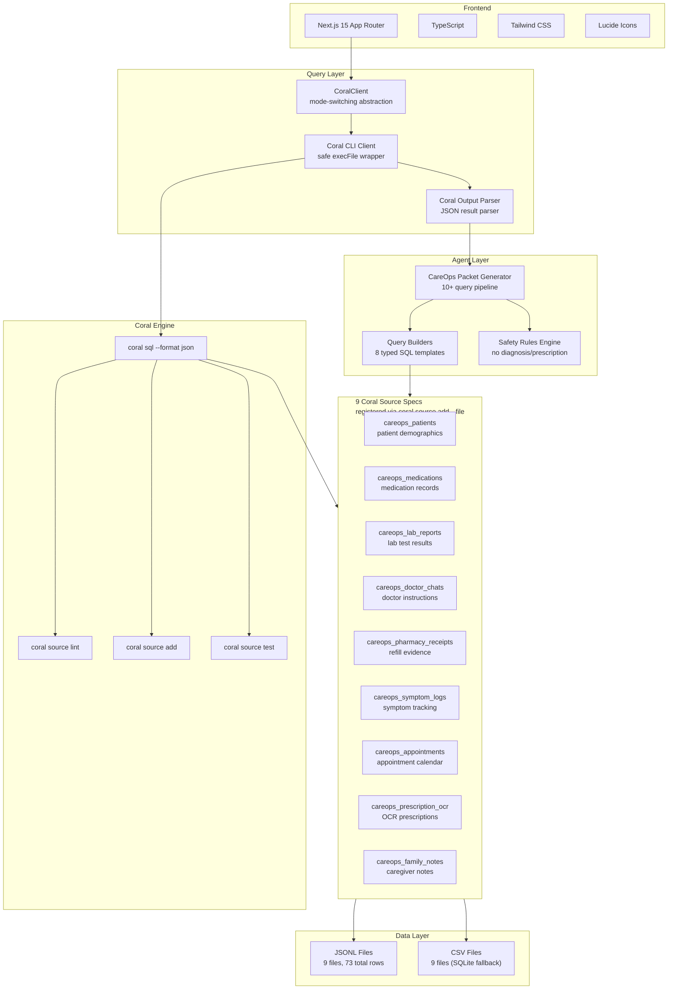

<div align="center">
  
  <h1 style="color: #0f172a; margin-bottom: 0;">CareOps Agent</h1>
  <p style="font-size: 1.2rem; color: #2563eb; font-weight: 500;">A Coral-powered family care coordination first mate</p>
</div>

<div align="center">

[](https://github.com/FiscalMindset/careops)
[](https://github.com/FiscalMindset/careops)
[](https://github.com/withcoral/coral)
[](https://nextjs.org/)
[](https://coral.co)

</div>

---

> [!IMPORTANT]
> **CareOps is Coral-first.** The app uses real Coral CLI execution (`coral sql`) as its default query engine — 9 registered JSONL-backed Coral sources, cross-source JOINs, and a doctor-ready packet generated from Coral results. SQLite/mock modes exist only as fallback for testing.

## 🩺 The Problem

When managing care for an aging parent or loved one, records are scattered everywhere. Doctor instructions in WhatsApp, lab reports in PDFs, prescriptions in photos, symptoms in notes apps. When you walk into a follow-up appointment, doctors waste 10 minutes just trying to piece together the timeline.

## 💡 The Solution: CareOps

CareOps joins medical records, prescription photos, lab reports, doctor chat instructions, pharmacy receipts, and symptom logs using **Coral SQL**. It generates a clean, doctor-ready packet with a unified timeline, missing record detection, and questions for the doctor.

> [!WARNING]
> **Safety Boundary**: CareOps does NOT diagnose, prescribe, or provide medical advice. It only organizes records, builds timelines, detects missing records, and generates questions to ask a licensed medical professional.

## 🆕 What's New

| Feature | Description |
|---------|-------------|
| **Interactive Mermaid Diagram** | Dashboard shows a live architecture flow diagram rendered via the `mermaid` npm package — no build step required |
| **Analytics Dashboard** | `/analytics` — per-patient KPI cards, symptom severity charts, cross-patient comparison, Ollama model status |
| **Interactive Exports** | `/exports` — list, preview, download, and delete exported Markdown packets |
| **Patient Selector** | Dropdown component across dashboard + analytics for quick patient switching |
| **5 Patients, 73 Records** | Expanded synthetic data for richer demos |
| **Ollama Integration** | Community source spec with 3 local models (llama3.2, phi3, kimi-k2.5) |
| **22 tests** | 13 careops + 9 coral-cli tests, all passing |

## 🌊 Why Coral? (Track 2)

Coral is central to this application. CareOps relies on joining **9 disparate data sources** through a single SQL interface.

| Layer | Implementation |
|-------|----------------|
| Source specs | Real Coral manifests (`coral/sources/careops/{spec}/manifest.yaml`) |
| Data backend | JSONL through Coral (`backend: jsonl`) |
| Query engine | `coral sql --format json` via Coral CLI v0.2.0 |
| App API | `CoralClient` → `coral-cli-client.ts` (safe `execFile` wrapper) |
| Packet generation | 10+ real `coral sql` calls assembled into a doctor-ready packet |
| SQLite | Fallback/cache only |
| Mock | Tests/offline only |

### Architecture



### Tech Stack



## 🪸 About Coral

Coral is an open-source SQL-based abstraction layer over disparate data sources. Instead of writing multiple API clients, Coral lets you query all sources with SQL JOINs.

**Coral repository**: https://github.com/withcoral/coral

### CareOps Coral Sources

9 custom Coral source specs are registered with the real Coral CLI:

| Source | Table | Format | Rows | Status |
|--------|-------|--------|------|--------|
| `careops_patients` | patients | JSONL | 5 | ✅ 2/2 tests pass |
| `careops_medications` | medications | JSONL | 9 | ✅ 2/2 tests pass |
| `careops_lab_reports` | lab_reports | JSONL | 12 | ✅ 2/2 tests pass |
| `careops_doctor_chats` | doctor_chats | JSONL | 7 | ✅ 2/2 tests pass |
| `careops_pharmacy_receipts` | pharmacy_receipts | JSONL | 11 | ✅ 2/2 tests pass |
| `careops_symptom_logs` | symptom_logs | JSONL | 11 | ✅ 2/2 tests pass |
| `careops_appointments` | appointments | JSONL | 6 | ✅ 2/2 tests pass |
| `careops_prescription_ocr` | prescription_ocr | JSONL | 5 | ✅ 2/2 tests pass |
| `careops_family_notes` | family_notes | JSONL | 7 | ✅ 2/2 tests pass |

**18/18 declared test queries pass** on registration.

## 🚀 Features

- **Dashboard**: Coral runtime status card showing mode, sources, and connection status
- **Interactive Data Sources**: 9 source cards with clickable CLI actions (lint → add → test → query) and live execution logs
- **Coral SQL Evidence Panel**: Verify Sources / Run Live Query / Generate Packet — all via real `coral sql`
- **Doctor Visit Packet Builder**: 10+ Coral SQL calls assembled into a 1-page visit summary
- **Care Timeline**: Chronological timeline across 7 Coral sources, sorted by date
- **Export**: Download the packet as Markdown
- **Safety Guardrails**: Never diagnoses, prescribes, or recommends medicine changes

## 💻 Tech Stack

- Next.js 15 (App Router) + TypeScript
- Tailwind CSS + Lucide Icons
- **Coral CLI v0.2.0** — real query engine
- `better-sqlite3` — test/fallback only
- Vitest

## 🛠️ Setup

### Prerequisites

- Node.js 18+
- npm
- Coral CLI v0.2.0+ (`npm install -g @withcoral/cli`)

### Quick Start

```bash
# 1. Clone and install
git clone https://github.com/FiscalMindset/careops.git
cd careops
npm install

# 2. Verify Coral CLI
coral --version

# 3. Register all 9 Coral sources
coral source add --file coral/sources/careops/patients/manifest.yaml
coral source add --file coral/sources/careops/medications/manifest.yaml
coral source add --file coral/sources/careops/lab_reports/manifest.yaml
coral source add --file coral/sources/careops/doctor_chats/manifest.yaml
coral source add --file coral/sources/careops/pharmacy_receipts/manifest.yaml
coral source add --file coral/sources/careops/symptom_logs/manifest.yaml
coral source add --file coral/sources/careops/appointments/manifest.yaml
coral source add --file coral/sources/careops/prescription_ocr/manifest.yaml
coral source add --file coral/sources/careops/family_notes/manifest.yaml

# 4. Start the app (Coral CLI mode — default)
npm run dev
```

### Quick Registration Script

```bash
for f in coral/sources/careops/*/manifest.yaml; do
  coral source add --file "$f"
done
```

### Alternative Modes

```bash
# SQLite fallback (requires: npm run seed first)
CAREOPS_QUERY_MODE=sqlite npm run dev

# Mock mode (for tests only)
CAREOPS_QUERY_MODE=mock npm run dev
```

## 🧪 Testing

```bash
npm test              # Unit tests (vitest) — 16 tests
npm run test:coral    # Coral integration tests — real coral sql
```

## 📸 Demo Workflow

1. `npm run dev` → open http://localhost:3000
2. `/data-sources` → click Lint → Add → Test → Query on any source to see real Coral CLI in action
3. `/evidence` → click "Verify Coral Sources" to see `coral source list` output
4. Click "Run Live Coral Query" to execute a cross-source JOIN
5. Click "Generate Packet from Coral" to see the full 10-query pipeline
6. `/packet` → select patient + purpose, generate a doctor-ready packet
7. Export as Markdown

## 🔧 Configuration

| Env Var | Default | Description |
|---------|---------|-------------|
| `CAREOPS_QUERY_MODE` | `coral_cli` | `coral_cli`, `sqlite`, or `mock` |
| `CORAL_CLI_PATH` | `coral` | Path to Coral CLI binary |
| `CORAL_CLI_TIMEOUT` | `20000` | Timeout (ms) for Coral CLI calls |
| `DATABASE_URL` | `file:./careops.db` | SQLite database path (fallback mode) |

## ⚠️ Known Coral CLI Limitations

- `backend: file` is **not supported** in v0.2.0 — use `backend: jsonl` instead
- `format` property in table definitions causes errors with `jsonl` backend — omit it
- Template variables (`{{input.DATA_PATH}}`) are **not resolved** when using `coral source add --file` — hardcode absolute paths in manifests

## 🧑‍💻 About Me

<div style="display: flex; align-items: center; gap: 1rem; margin-top: 1rem; border: 1px solid #e2e8f0; padding: 1rem; border-radius: 8px;">
  
  <div>
    <h3 style="margin: 0; color: #0f172a;">FiscalMindset</h3>
    <p style="margin: 0.2rem 0; color: #2563eb; font-weight: 500;">Open-source builder exploring Coral-powered personal agents</p>
    <p style="margin: 0; color: #64748b; font-size: 0.9rem;">I build practical AI systems, source specs, and agent workflows that turn scattered data into useful products.</p>
  </div>
</div>
