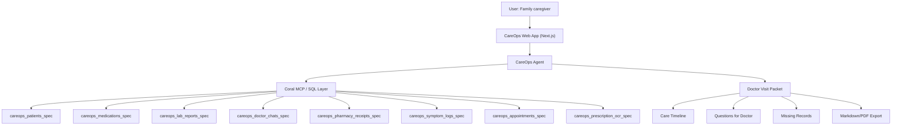

<div align="center">
  
  <h1 style="color: #0f172a; margin-bottom: 0;">CareOps Agent</h1>
  <p style="font-size: 1.2rem; color: #2563eb; font-weight: 500;">A Coral-powered family care coordination first mate</p>
</div>

---

<div style="background-color: #f8fafc; padding: 1.5rem; border-radius: 8px; border: 1px solid #d9e1e8; margin-bottom: 2rem;">
  <h2 style="color: #0f172a; margin-top: 0;">🩺 The Problem</h2>
  <p style="color: #64748b; line-height: 1.6;">
    When managing care for an aging parent or loved one, records are scattered everywhere. You have doctor instructions in WhatsApp, lab reports in PDFs, prescriptions in photos, and symptoms tracked in notes apps. When you walk into a follow-up appointment, doctors waste 10 minutes just trying to piece together the timeline. 
  </p>
</div>

<div style="background-color: #f0fdf4; padding: 1.5rem; border-radius: 8px; border: 1px solid #bbf7d0; margin-bottom: 2rem;">
  <h2 style="color: #15803d; margin-top: 0;">💡 The Solution: CareOps</h2>
  <p style="color: #166534; line-height: 1.6;">
    CareOps Agent helps families prepare for doctor visits by turning scattered care records into one clean, doctor-ready packet. <strong>It joins medical records, prescription photos, lab reports, doctor chat instructions, pharmacy receipts, and symptom logs using Coral.</strong> The output is a safe care timeline and a 1-page summary to hand to the doctor.
  </p>
</div>

> [!WARNING]
> **Safety Boundary**: CareOps does NOT diagnose, prescribe, or provide medical advice. It only organizes records, builds timelines, detects missing records, and generates questions to ask a licensed medical professional.

## 🌊 Why Coral? (Track 2)

Coral is central to this application. CareOps relies on joining **9 disparate data sources** (patients, medications, labs, chats, pharmacy, symptoms, appointments, OCR, and family notes). 

Instead of writing complex application-level map-reduce logic, CareOps uses the **Coral MCP (Model Context Protocol)** to run cross-source SQL queries. Coral abstracts the silos, allowing the agent to write a single `SELECT ... LEFT JOIN` query to pull a unified patient timeline.

## 🏛️ Architecture



## 🚀 Features

- **Dashboard**: Professional healthcare aesthetic (white/black with minimal accents).
- **Data Sources**: View all connected (simulated) specs.
- **Care Timeline**: Chronological, Coral-joined timeline of all events.
- **Doctor Visit Packet Builder**: Generates the 1-page visit summary.
- **Coral SQL Evidence Panel**: Fully transparent UI showing exactly which sources and SQL queries were used.
- **Export**: Download the packet as Markdown.
- **Mock Mode**: Fully runnable locally via SQLite simulating the Coral MCP.

## 💻 Tech Stack
- Next.js (App Router) + TypeScript
- Tailwind CSS + Lucide Icons
- Node.js backend route handlers
- local `better-sqlite3` (Mock Coral layer)
- Vitest

## 🛠️ Setup Instructions

1. **Clone & Install**
   ```bash
   git clone https://github.com/FiscalMindset/careops.git
   cd careops
   npm install
   ```

2. **Environment**
   ```bash
   cp .env.example .env.local
   ```
   *(Ensure `NEXT_PUBLIC_USE_MOCK_CORAL=true` is set for local testing without API keys)*

3. **Seed Database**
   ```bash
   npm run seed
   ```

4. **Run App**
   ```bash
   npm run dev
   ```

See `/docs/COMMANDS.md` and `/docs/API_KEYS.md` for full details.

## 📸 Demo Workflow
1. Navigate to `/packet`.
2. See the auto-generated "Diabetes Follow-up" packet.
3. Review the **Coral SQL Evidence** section to see the raw join query.
4. Export the packet.

## 🧑‍💻 About Me

<div style="display: flex; align-items: center; gap: 1rem; margin-top: 1rem; border: 1px solid #e2e8f0; padding: 1rem; border-radius: 8px;">
  
  <div>
    <h3 style="margin: 0; color: #0f172a;">FiscalMindset</h3>
    <p style="margin: 0.2rem 0; color: #2563eb; font-weight: 500;">Open-source builder exploring Coral-powered personal agents</p>
    <p style="margin: 0; color: #64748b; font-size: 0.9rem;">I build practical AI systems, source specs, and agent workflows that turn scattered data into useful products.</p>
  </div>
</div>
