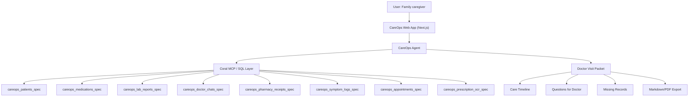
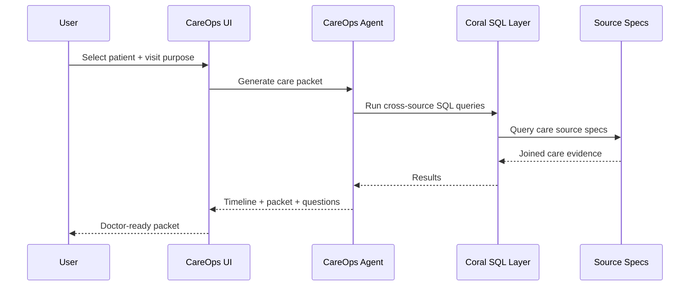

# CareOps Architecture

This document outlines the system architecture and data flow for the CareOps Agent. 

## System Architecture

The application is built on Next.js but relies fundamentally on the **Coral MCP (Model Context Protocol)** as a data abstraction layer. Coral handles the cross-source joins, while the CareOps Agent focuses purely on the business logic of summarizing those joined rows and applying safety constraints.

## Data and Request Flow

When a user requests a Doctor Visit Packet, the system follows this sequence:

## The Role of Coral
Coral acts as the universal translator. Without Coral, CareOps would need 9 different API client libraries to fetch from the lab portal, the pharmacy portal, WhatsApp exports, etc., and then write complex `map-reduce` logic in Node.js to correlate them by date. 

With Coral, CareOps simply executes `LEFT JOIN` SQL queries, leaving the heavy lifting of data unification to the MCP.
