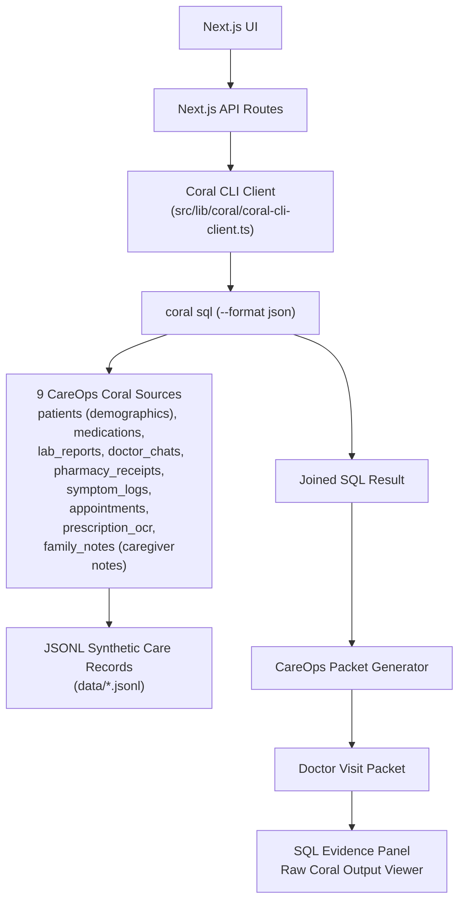
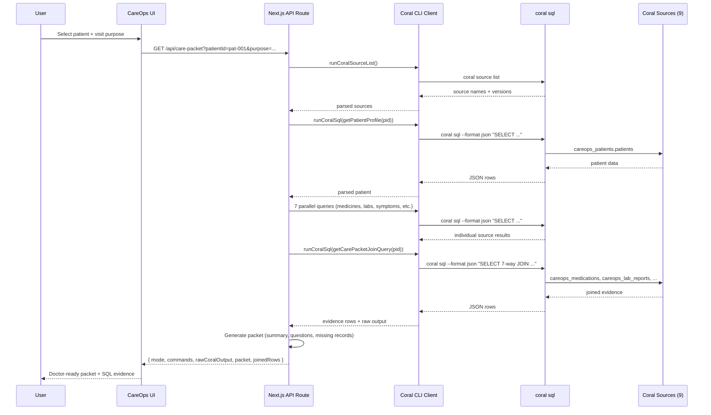
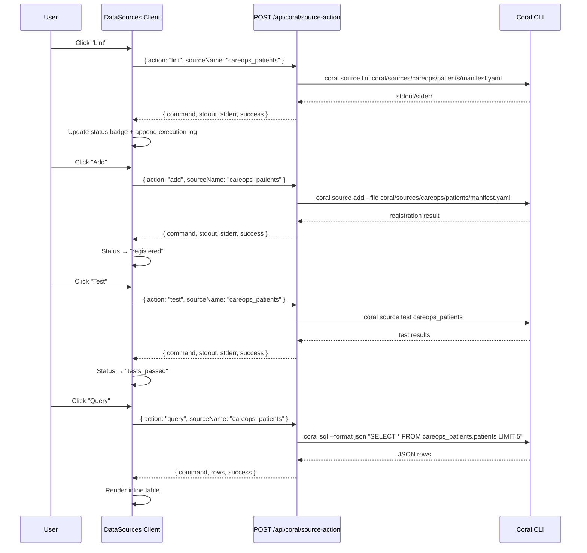
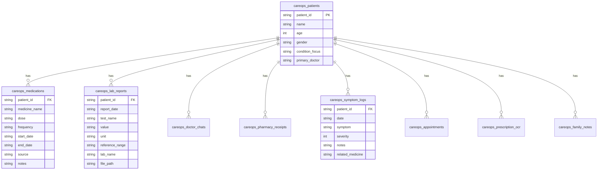

# CareOps Architecture

This document outlines the system architecture, data flow, and source spec design for the CareOps Agent.

## System Architecture

The application is built on Next.js but relies fundamentally on the **Coral CLI** as the query engine. Coral handles the cross-source joins, while the CareOps Agent focuses purely on the business logic of summarizing those joined rows and applying safety constraints.

## API Routes

| Route | Method | Purpose |
|-------|--------|---------|
| `/api/coral/source-list` | GET | Runs `coral source list`, returns parsed sources with mode info |
| `/api/coral/source-action` | POST | Accepts `{action, sourceName}` — runs lint/add/test/query against real Coral CLI |
| `/api/coral/run-query` | GET | Runs a cross-source JOIN query for a given patientId |
| `/api/care-packet` | GET | Full packet pipeline: source list → patient profile → 7 individual queries → cross-source JOIN |
| `/api/query` | GET | Natural-language-style query endpoint |
| `/api/packet` | GET | Legacy packet endpoint |
| `/api/export` | GET | Markdown export of the doctor visit packet |

## Query Execution Modes

| Mode | Engine | Default | When Used |
|------|--------|---------|-----------|
| `coral_cli` | Real `coral sql` via CLI | Yes | Production demo |
| `sqlite` | `better-sqlite3` | No | Fallback / offline |
| `mock` | `better-sqlite3` | No | Tests only |

Set via `CAREOPS_QUERY_MODE` env var. Default is `coral_cli`.

## Data Flow: Doctor Visit Packet

When a user requests a Doctor Visit Packet, the system follows this sequence:

## Data Flow: Interactive Data Sources

Each source card on `/data-sources` can execute CLI actions independently:

## Core Files

| File | Purpose |
|------|---------|
| `src/lib/coral/coral-cli-client.ts` | Safe `coral sql` / `source list` / `source lint` / `source add` / `source test` wrapper via `execFile` |
| `src/lib/coral/careops-queries.ts` | 10 predefined SQL query templates (no raw SQL from browser) |
| `src/lib/coral/coral-output-parser.ts` | Parse `--format json` and `source list` output |
| `src/lib/coral/client.ts` | Mode-switching CoralClient (CLI / SQLite / Mock) |
| `app/api/coral/source-list/route.ts` | Run `coral source list`, return parsed JSON |
| `app/api/coral/source-action/route.ts` | Run lint/add/test/query actions per source |
| `app/api/coral/run-query/route.ts` | Run `coral sql --format json`, return parsed rows |
| `app/api/care-packet/route.ts` | Full packet pipeline via 10+ real coral sql calls |
| `app/data-sources/data-sources-client.tsx` | Interactive client component with CLI buttons |
| `app/evidence/page.tsx` | Interactive Coral proof page (3 action buttons) |

## The Role of Coral

Coral acts as the universal query engine. Without Coral, CareOps would need 9 different API client libraries to fetch from the lab portal, the pharmacy portal, WhatsApp exports, etc., and then write complex `map-reduce` logic in Node.js to correlate them by date.

With Coral, CareOps simply executes SQL queries against registered source specs, leaving the heavy lifting of data unification to the Coral engine.

The app never hides the Coral layer. Every API response includes:
- `mode` (always `coral_cli` in production)
- `commands` (real CLI commands executed)
- `rawCoralOutput` (raw stdout from `coral sql`)
- `sourcesUsed` (registered Coral source names)

## Source Spec Schemas

Each CareOps Coral source is a `manifest.yaml` with `dsl_version: 3`, `backend: jsonl`, and a single table backed by a JSONL file. Below are the schemas for all 9 source specs.

### careops_patients
- **Table:** `patients`
- **File:** `data/patients.jsonl` (5 rows)
- **Columns:**
  | Column | Type | Description |
  |--------|------|-------------|
  | `patient_id` | Utf8 | Unique patient identifier |
  | `name` | Utf8 | Patient full name |
  | `age` | Int64 | Patient age |
  | `gender` | Utf8 | Patient gender |
  | `condition_focus` | Utf8 | Primary condition for current care focus |
  | `primary_doctor` | Utf8 | Primary care physician name |
- **Test queries:** SELECT with LIMIT 3, COUNT(*)
- **Used by:** All cross-source queries (JOIN target), patient selector UI, analytics dashboard

### careops_medications
- **Table:** `medications`
- **File:** `data/medications.jsonl` (9 rows)
- **Columns:**
  | Column | Type | Description |
  |--------|------|-------------|
  | `patient_id` | Utf8 | FK to careops_patients |
  | `medicine_name` | Utf8 | Generic or brand medicine name |
  | `dose` | Utf8 | Dosage strength (e.g. 500 mg) |
  | `frequency` | Utf8 | Administration schedule |
  | `start_date` | Utf8 | Medication start date |
  | `end_date` | Utf8 (nullable) | Medication end date if discontinued |
  | `source` | Utf8 | Origin of this record |
  | `notes` | Utf8 | Prescribing or clinical notes |
- **Test queries:** SELECT with LIMIT 3, COUNT(*)
- **Used by:** Current medicines list, medicine change timeline, refill verification, packet generation

### careops_lab_reports
- **Table:** `lab_reports`
- **File:** `data/lab_reports.jsonl` (12 rows)
- **Columns:**
  | Column | Type | Description |
  |--------|------|-------------|
  | `patient_id` | Utf8 | FK to careops_patients |
  | `report_date` | Utf8 | Lab collection or report date |
  | `test_name` | Utf8 | Lab test name (e.g. HbA1c) |
  | `value` | Utf8 | Test result value |
  | `unit` | Utf8 | Unit of measurement |
  | `reference_range` | Utf8 | Normal reference range |
  | `lab_name` | Utf8 | Performing laboratory |
  | `file_path` | Utf8 | Path to lab report PDF |
- **Test queries:** SELECT with LIMIT 3, COUNT(*)
- **Used by:** Recent lab results in packet, HbA1c/glucose tracking, analytics charts

### careops_doctor_chats
- **Table:** `doctor_chats`
- **File:** `data/doctor_chats.jsonl` (7 rows)
- **Columns:**
  | Column | Type | Description |
  |--------|------|-------------|
  | `patient_id` | Utf8 | FK to careops_patients |
  | `date` | Utf8 | Message or instruction date |
  | `doctor` | Utf8 | Doctor name |
  | `message` | Utf8 | Full instruction text |
  | `instruction_type` | Utf8 | Category (medicine_change, safety_instruction, visit_preparation, monitoring) |
  | `medicine_mentioned` | Utf8 (nullable) | Medicine referenced in instruction |
  | `followup_date` | Utf8 (nullable) | Recommended follow-up date |
- **Test queries:** SELECT with LIMIT 3, COUNT(*)
- **Used by:** Medicine change detection, safety instruction section in packet, timeline

### careops_pharmacy_receipts
- **Table:** `pharmacy_receipts`
- **File:** `data/pharmacy_receipts.jsonl` (11 rows)
- **Columns:**
  | Column | Type | Description |
  |--------|------|-------------|
  | `patient_id` | Utf8 | FK to careops_patients |
  | `date` | Utf8 | Purchase or refill date |
  | `medicine` | Utf8 | Medicine name and strength dispensed |
  | `quantity` | Utf8 | Quantity dispensed |
  | `amount` | Utf8 | Total cost in INR |
  | `pharmacy` | Utf8 | Pharmacy name |
  | `receipt_file` | Utf8 | Path to receipt image |
- **Test queries:** SELECT with LIMIT 3, COUNT(*)
- **Used by:** Refill evidence in packet, adherence verification

### careops_symptom_logs
- **Table:** `symptom_logs`
- **File:** `data/symptom_logs.jsonl` (11 rows)
- **Columns:**
  | Column | Type | Description |
  |--------|------|-------------|
  | `patient_id` | Utf8 | FK to careops_patients |
  | `date` | Utf8 | Date symptom observed |
  | `symptom` | Utf8 | Symptom description |
  | `severity` | Int64 | Severity rating 1–5 |
  | `notes` | Utf8 | Additional context |
  | `related_medicine` | Utf8 | Potentially related medicine |
- **Test queries:** SELECT with LIMIT 3, COUNT(*)
- **Used by:** Symptom tracking section in packet, analytics severity chart, medicine side-effect correlation

### careops_appointments
- **Table:** `appointments`
- **File:** `data/appointments.jsonl` (6 rows)
- **Columns:**
  | Column | Type | Description |
  |--------|------|-------------|
  | `patient_id` | Utf8 | FK to careops_patients |
  | `appointment_date` | Utf8 | Appointment date |
  | `doctor` | Utf8 | Doctor name |
  | `speciality` | Utf8 | Medical speciality |
  | `reason` | Utf8 | Reason for visit |
  | `status` | Utf8 | Status (scheduled/completed) |
- **Test queries:** SELECT with LIMIT 3, COUNT(*)
- **Used by:** Upcoming appointments display, timeline, packet scheduling section

### careops_prescription_ocr
- **Table:** `prescription_ocr`
- **File:** `data/prescription_ocr.jsonl` (5 rows)
- **Columns:**
  | Column | Type | Description |
  |--------|------|-------------|
  | `patient_id` | Utf8 | FK to careops_patients |
  | `image_file` | Utf8 | Path to prescription image |
  | `ocr_text` | Utf8 | Raw OCR-extracted text |
  | `extracted_medicines` | Utf8 | Parsed medicine names |
  | `doctor_name` | Utf8 | Prescribing doctor |
  | `prescription_date` | Utf8 | Date of prescription |
- **Test queries:** SELECT with LIMIT 3, COUNT(*)
- **Used by:** OCR medicine cross-reference with medications table, packet evidence

### careops_family_notes
- **Table:** `family_notes`
- **File:** `data/family_notes.jsonl` (7 rows)
- **Columns:**
  | Column | Type | Description |
  |--------|------|-------------|
  | `patient_id` | Utf8 | FK to careops_patients |
  | `date` | Utf8 | Note entry date |
  | `note_author` | Utf8 | Family member who wrote the note |
  | `note_text` | Utf8 | Note content |
  | `priority` | Utf8 | Priority (high/normal) |
- **Test queries:** SELECT with LIMIT 3, COUNT(*)
- **Used by:** Additional context in packet, timeline, caregiver observations

### Relationship Diagram

