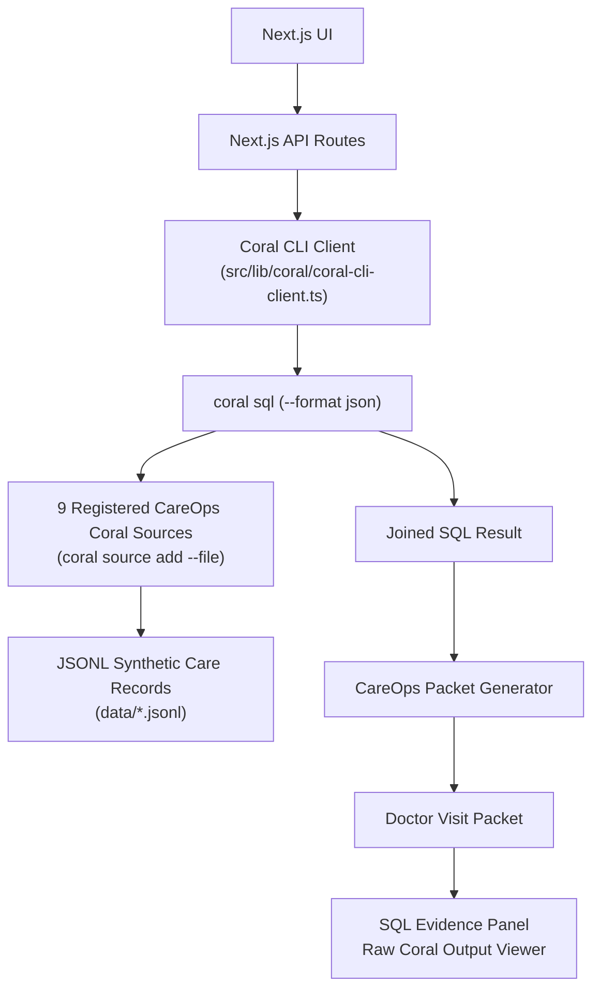
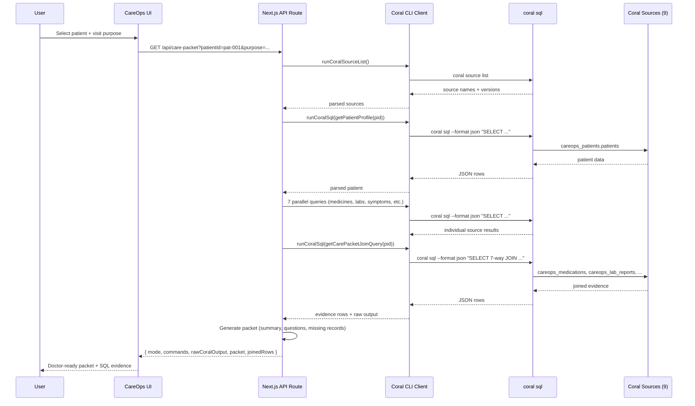
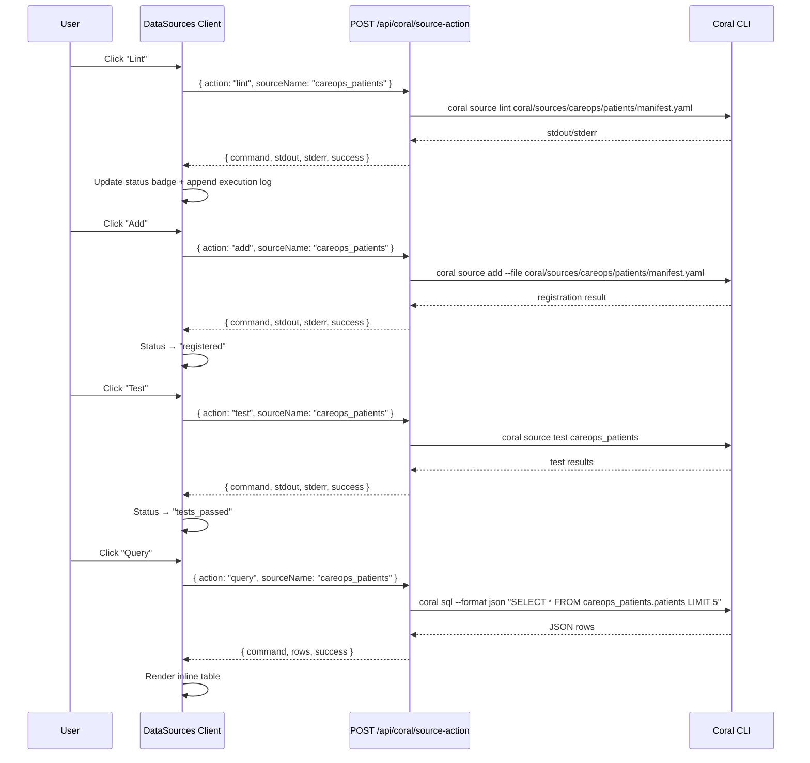

# CareOps Architecture

This document outlines the system architecture and data flow for the CareOps Agent.

## System Architecture

The application is built on Next.js but relies fundamentally on the **Coral CLI** as the query engine. Coral handles the cross-source joins, while the CareOps Agent focuses purely on the business logic of summarizing those joined rows and applying safety constraints.

## API Routes

| Route | Method | Purpose |
|-------|--------|---------|
| `/api/coral/source-list` | GET | Runs `coral source list`, returns parsed sources with mode info |
| `/api/coral/source-action` | POST | Accepts `{action, sourceName}` — runs lint/add/test/query against real Coral CLI |
| `/api/coral/run-query` | GET | Runs a cross-source JOIN query for a given patientId |
| `/api/care-packet` | GET | Full packet pipeline: source list → patient profile → 7 individual queries → cross-source JOIN |
| `/api/query` | GET | Natural-language-style query endpoint |
| `/api/packet` | GET | Legacy packet endpoint |
| `/api/export` | GET | Markdown export of the doctor visit packet |

## Query Execution Modes

| Mode | Engine | Default | When Used |
|------|--------|---------|-----------|
| `coral_cli` | Real `coral sql` via CLI | Yes | Production demo |
| `sqlite` | `better-sqlite3` | No | Fallback / offline |
| `mock` | `better-sqlite3` | No | Tests only |

Set via `CAREOPS_QUERY_MODE` env var. Default is `coral_cli`.

## Data Flow: Doctor Visit Packet

When a user requests a Doctor Visit Packet, the system follows this sequence:

## Data Flow: Interactive Data Sources

Each source card on `/data-sources` can execute CLI actions independently:

## Core Files

| File | Purpose |
|------|---------|
| `src/lib/coral/coral-cli-client.ts` | Safe `coral sql` / `source list` / `source lint` / `source add` / `source test` wrapper via `execFile` |
| `src/lib/coral/careops-queries.ts` | 10 predefined SQL query templates (no raw SQL from browser) |
| `src/lib/coral/coral-output-parser.ts` | Parse `--format json` and `source list` output |
| `src/lib/coral/client.ts` | Mode-switching CoralClient (CLI / SQLite / Mock) |
| `app/api/coral/source-list/route.ts` | Run `coral source list`, return parsed JSON |
| `app/api/coral/source-action/route.ts` | Run lint/add/test/query actions per source |
| `app/api/coral/run-query/route.ts` | Run `coral sql --format json`, return parsed rows |
| `app/api/care-packet/route.ts` | Full packet pipeline via 10+ real coral sql calls |
| `app/data-sources/data-sources-client.tsx` | Interactive client component with CLI buttons |
| `app/evidence/page.tsx` | Interactive Coral proof page (3 action buttons) |

## The Role of Coral

Coral acts as the universal query engine. Without Coral, CareOps would need 9 different API client libraries to fetch from the lab portal, the pharmacy portal, WhatsApp exports, etc., and then write complex `map-reduce` logic in Node.js to correlate them by date.

With Coral, CareOps simply executes SQL queries against registered source specs, leaving the heavy lifting of data unification to the Coral engine.

The app never hides the Coral layer. Every API response includes:
- `mode` (always `coral_cli` in production)
- `commands` (real CLI commands executed)
- `rawCoralOutput` (raw stdout from `coral sql`)
- `sourcesUsed` (registered Coral source names)
